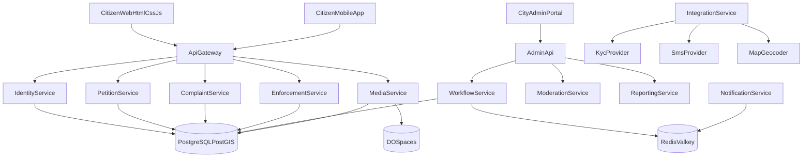

# Backend Architecture Baseline

## Product Goal
Build a unified municipal platform for three civic flows:
- petitions
- complaints
- municipal enforcement reports

The platform must support residents, moderators, municipal operators, inspectors, supervisors, and administrators.

## Core Requirements
- Secure registration and identity verification through an external KYC provider.
- Public petition workflow with signatures and municipality responses.
- Complaint workflow with photo/video uploads and geodata.
- Municipal enforcement workflow where citizen reports create an inspector triage case, not an automatic fine.
- Multilingual platform with English as the default language and support for Hebrew, Russian, and Arabic.
- Support for both `LTR` and `RTL` interface behavior.
- Web client implemented with `HTML + CSS + JavaScript`.

## Domain Model
- `Identity`
  - signup
  - login
  - sessions
  - MFA or passkeys
  - KYC orchestration
  - device trust and risk scoring
- `Petitions`
  - create petition
  - moderation
  - publication
  - signatures
  - official response
- `Complaints`
  - city issue reporting
  - media upload
  - geodata normalization
  - assignment to department
  - SLA tracking
- `MunicipalEnforcement`
  - citizen reports of potential violations
  - geodata trust checks
  - inspector triage
  - dispatch
  - validated outcome after manual review
- `Media`
  - image and video storage
  - metadata extraction
  - EXIF and GPS extraction
  - preview generation
  - moderation and retention
- `Reporting`
  - dashboards
  - heatmaps
  - weekly reports
  - operational KPIs

## High-Level Architecture
Use a modular backend with clear bounded contexts. At the start, several logical services may ship as one deployable application, but the codebase and data boundaries should remain explicit.

## Service Baseline
### `api-gateway`
- Public entry point for web and mobile clients.
- Handles auth context, throttling, and request routing.

### `admin-api`
- Entry point for city staff, operators, moderators, inspectors, and supervisors.
- Exposes operational actions, dashboards, and case workflows.

### `identity-service`
- Phone verification.
- Email verification.
- Passwordless login, password + MFA, or passkey support.
- KYC orchestration with external provider.
- Step-up authentication for sensitive actions.

### `petition-service`
- Petition drafts and moderation.
- Publication and deadline tracking.
- Signature workflow.
- Official municipal response workflow.

### `complaint-service`
- Complaint intake and categorization.
- Routing to the right city unit or department.
- Location normalization and SLA handling.

### `enforcement-service`
- Citizen reports of possible municipal violations.
- Triage queue for inspectors.
- Dispatch and field verification workflow.
- Outcome handling, including warnings, no-action closure, or validated fine issuance after manual confirmation.

### `media-service`
- Secure uploads to DO Spaces.
- Virus scanning and metadata extraction.
- Thumbnail, preview, and poster generation.
- Media access policy and retention handling.

### `workflow-service`
- Assignment queues.
- Status transitions.
- Escalations and reminders.
- Shared task orchestration across complaints, petitions, and enforcement.

### `moderation-service`
- Text and media moderation.
- Duplicate detection hooks.
- Manual review queues.

### `notification-service`
- SMS, email, push notifications, and in-app inbox events.
- Localized templates per language.

### `reporting-service`
- Management dashboards.
- Public reporting.
- Heatmaps and trend analysis.

### `integration-service`
- External KYC provider.
- SMS provider.
- Geocoding and reverse geocoding.
- Optional AI modules later in the roadmap.

## Storage Baseline
### `PostgreSQL + PostGIS`
- Primary transactional database.
- Spatial operations for districts, city boundaries, and geo search.
- Full-text search baseline for multilingual content and case search.

### `Redis / Valkey`
- Rate limiting.
- Session and challenge support.
- Queues for async processing.
- Hot counters and short-lived cache.

### `DO Spaces`
- Petition attachments.
- Complaint photo and video evidence.
- Enforcement report media.
- KYC document and selfie media under restricted access policies.

## Security Baseline
- External KYC provider for document OCR, liveness, and face match.
- One verified government ID linked to one active account unless manually resolved.
- Step-up authentication for:
  - petition signature
  - phone or document change
  - access to KYC media
  - staff access
  - validated enforcement outcome actions
- Full audit trail for staff and inspector actions.
- Separate retention policies for KYC media and civic report media.

## Geodata Baseline
For complaint and enforcement flows, store four location layers:
- `device_geo`
- `media_exif_geo`
- `user_entered_address`
- `normalized_geo`

Rules:
- If geodata is low-confidence or mismatched with the expected city, require manual address entry.
- Do not automatically reject the report only because of a geodata mismatch.
- Lower the trust score and send the case through a more careful triage path.

## Municipal Enforcement Baseline
Municipal enforcement is a separate domain from complaints.

- `complaint`
  - asks the city to solve a problem
- `enforcement report`
  - reports a possible violation that may require inspection, dispatch, and legal follow-up

Citizen media can create evidence for review, but cannot directly create a fine without inspector validation.

## Multilingual Baseline
Supported languages:
- English
- Hebrew
- Russian
- Arabic

Rules:
- English is the default locale.
- Hebrew and Arabic require `RTL` support.
- Russian and English use `LTR`.
- All user-facing texts, notifications, and admin-facing templates must be localizable.
- Categories, statuses, canned replies, and public informational pages must support translations.
- Search strategy must account for multilingual text, not only a single language.

## Web Baseline
The web client is planned with:
- `HTML`
- `CSS`
- `JavaScript`

This keeps the public site simple, transparent, and easy to optimize for accessibility and multilingual rendering.

## Stage 1 Output
This document is the approved architecture baseline for:
- platform scope
- core services
- storage responsibilities
- multilingual requirements
- security direction
- complaint and enforcement geo workflows
