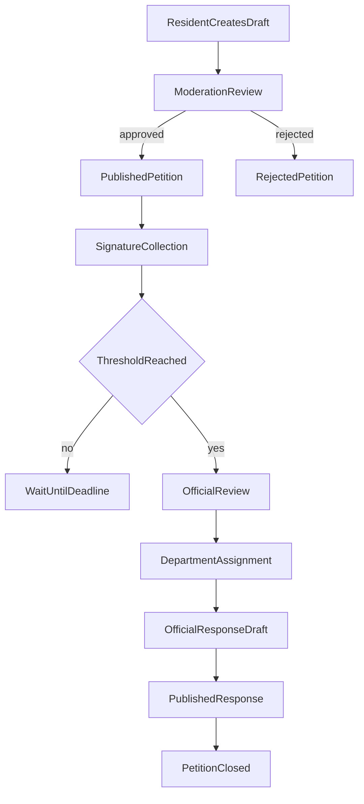
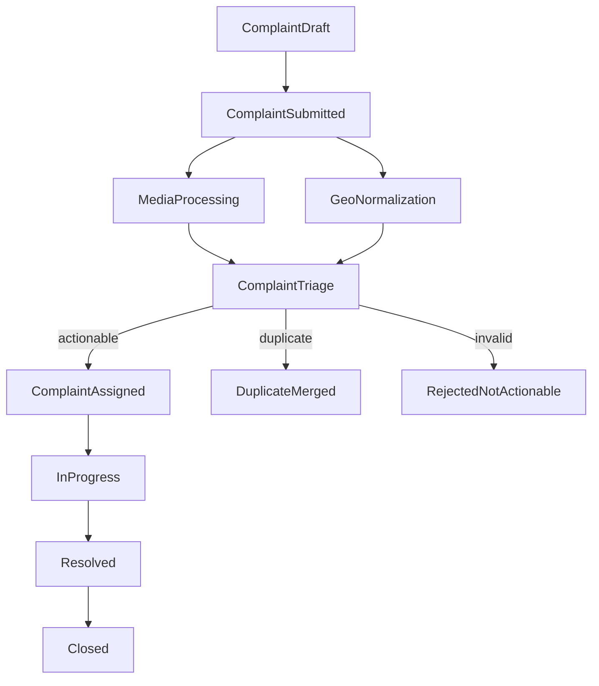
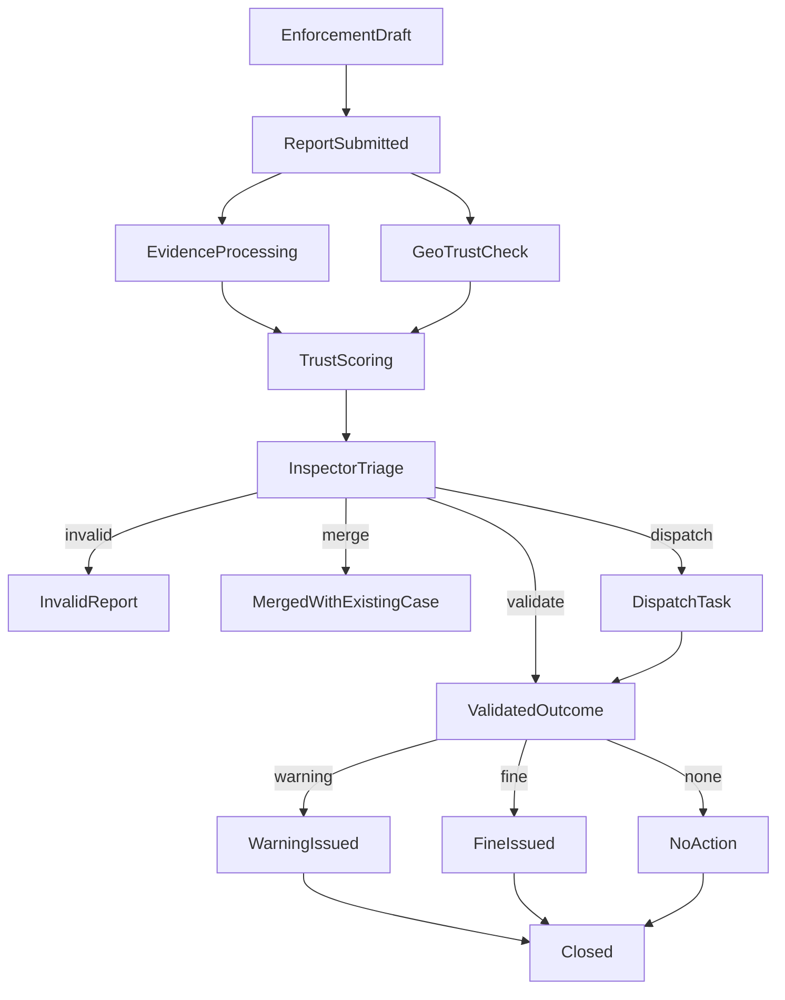
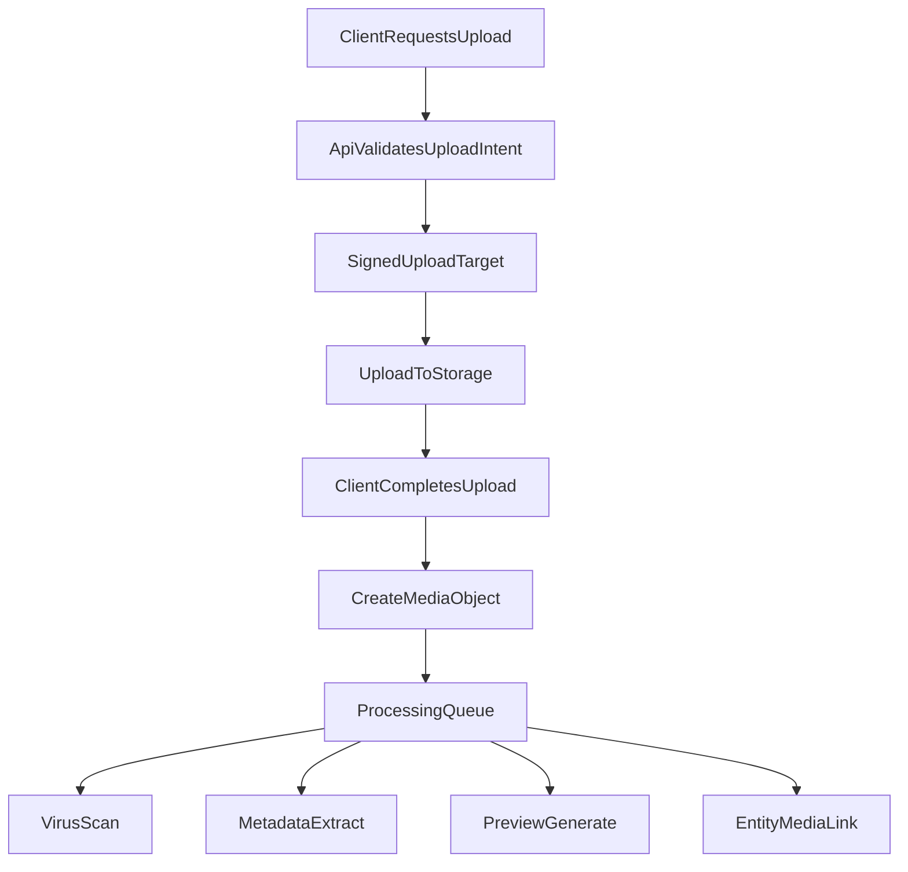
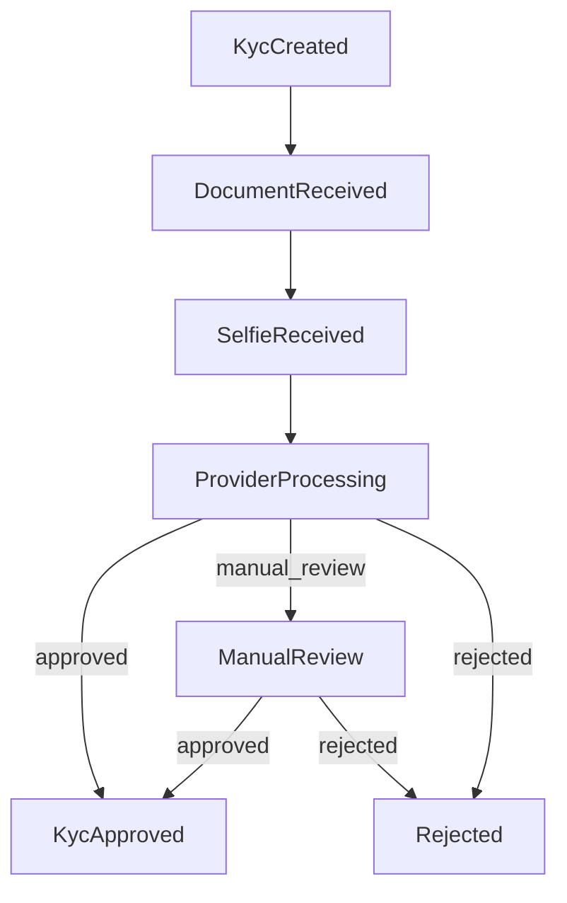

# Workflows

## Purpose
This document defines Stage 3 workflow behavior for:
- public and admin process boundaries
- role responsibilities
- petition, complaint, and enforcement lifecycles
- media upload flow
- KYC verification flow and callbacks

## Roles
### `resident`
- browses public petitions
- signs petitions after identity verification
- submits complaints
- submits enforcement reports
- receives updates and notifications

### `moderator`
- reviews public-facing text and media
- rejects, edits, or escalates problematic content
- merges duplicates where policy allows

### `operator`
- handles complaint queues
- routes cases to departments
- updates statuses
- coordinates with supervisors

### `inspector`
- handles municipal enforcement triage
- reviews geodata and evidence
- dispatches field work or closes invalid reports
- records validated outcomes

### `supervisor`
- overrides routing or trust decisions
- reviews escalations
- approves sensitive operational actions

### `municipality_staff`
- processes petitions
- publishes official responses
- manages department-facing workflows

### `admin`
- manages configuration, roles, categories, and access policies
- audits privileged actions

## Workflow Queues
- `moderation_queue`
- `petition_review_queue`
- `complaint_triage_queue`
- `complaint_assignment_queue`
- `enforcement_triage_queue`
- `enforcement_dispatch_queue`
- `identity_review_queue`
- `media_processing_queue`
- `notification_queue`

## Public vs Admin API Boundaries
### Public API
Used by:
- public website
- resident mobile clients

Capabilities:
- registration and login
- KYC session initiation
- petition browsing and signing
- complaint submission
- enforcement report submission
- own-profile and own-case status views
- notification preference management

### Admin API
Used by:
- moderators
- operators
- inspectors
- supervisors
- municipality staff
- administrators

Capabilities:
- moderation queues
- triage and assignment
- dispatch workflows
- official responses
- case overrides
- localized template management
- analytics and audit views

## Petition Workflow
### Lifecycle
`draft -> moderation_review -> published -> threshold_reached -> official_review -> answered -> closed`

Possible alternative exits:
- `draft -> rejected`
- `published -> expired`
- `official_review -> implemented`

### Process
1. Resident creates petition draft.
2. Media uploads, if any, are processed asynchronously.
3. Moderator reviews text and attachments.
4. If accepted, petition becomes public.
5. Identity-verified residents may sign.
6. If threshold or deadline rules are met, the municipality workflow opens.
7. Municipality staff assigns the petition to the relevant department.
8. Official response is drafted, localized if needed, and published.
9. Petition is closed or marked implemented.

## Complaint Workflow
### Lifecycle
`draft -> submitted -> triage -> assigned -> in_progress -> resolved -> closed`

Alternative exits:
- `submitted -> duplicate_merged`
- `triage -> rejected_not_actionable`
- `resolved -> reopened`

### Process
1. Resident submits complaint with text, media, and location.
2. Media is processed and normalized.
3. Geodata is checked and normalized.
4. Complaint enters triage queue.
5. Operator reviews category, trust level, and district.
6. Complaint is assigned to a department or service unit.
7. Operational work progresses.
8. Resolution note is recorded.
9. Resident is notified and complaint is closed unless reopened.

## Enforcement Workflow
### Lifecycle
`draft -> submitted -> trust_scored -> triage -> dispatched -> validated_outcome -> closed`

Alternative exits:
- `triage -> invalid_report`
- `triage -> merged_with_existing_case`
- `validated_outcome -> no_action`
- `validated_outcome -> warning`
- `validated_outcome -> fine_issued`

### Process
1. Resident opens `report violation`.
2. App captures live media if possible.
3. System records:
   - device geodata
   - EXIF geodata if present
   - manual address if required or provided
4. Media and geodata are normalized.
5. Trust scoring runs.
6. Inspector triage begins.
7. Inspector may:
   - close as invalid
   - merge with existing case
   - dispatch field task
   - validate official outcome
8. Only validated staff action may produce a fine or warning.

## Media Upload Flow
### Scope
Used by:
- petition attachments
- complaint media
- enforcement evidence
- KYC document and selfie capture

### Flow
1. Client requests upload session from the API.
2. API validates user, media class, and size/type constraints.
3. API returns a signed upload target or upload session token.
4. Client uploads directly to storage or through a proxy endpoint.
5. Client notifies API that upload is complete.
6. API creates `media_object` and queues processing jobs.
7. Media processing performs:
   - virus scan
   - metadata extraction
   - EXIF/GPS extraction
   - thumbnail/poster generation
   - transcode if video
8. Business entity is linked to processed media.

## KYC Verification Workflow
### Resident-side flow
1. Resident starts KYC session.
2. System creates verification record and provider session.
3. Resident submits document images.
4. Resident submits selfie/live capture.
5. Provider runs OCR, liveness, and face match.
6. Provider sends callback webhook.
7. System updates verification result.
8. If required, identity review queue is created.

### State transitions
`created -> document_received -> selfie_received -> provider_processing -> approved`

Alternative paths:
- `provider_processing -> manual_review`
- `provider_processing -> rejected`
- `manual_review -> approved`
- `manual_review -> rejected`

## KYC Callback Handling
### Callback contract requirements
- verify provider signature
- verify idempotency token or provider reference
- reject unsigned or malformed callbacks
- persist raw provider payload for audit if policy allows
- update only allowed state transitions

### Callback actions
- `document_verified`
  - update OCR result
- `selfie_verified`
  - update selfie checks
- `verification_approved`
  - set `assurance_level=identity_verified`
- `verification_manual_review`
  - create review queue item
- `verification_rejected`
  - mark KYC rejected and notify resident

## Role-Centric Workflow Summary
### Resident
- register
- verify identity
- create petition
- sign petition
- submit complaint
- submit enforcement report
- track own statuses

### Moderator
- review public-facing content
- reject unsafe or duplicate submissions
- approve petition publication

### Operator
- triage complaints
- assign to department
- manage SLA and resident communication

### Inspector
- review enforcement trust score and evidence
- dispatch field response
- record validated outcome

### Supervisor
- resolve escalations
- override routing or trust decisions
- approve sensitive actions

### Municipality Staff
- review petitions after threshold
- publish official responses

### Admin
- manage roles, categories, system settings, templates, and audit

## Workflow Design Rules
- Public users never see internal-only status notes.
- Legal outcomes always require staff-authenticated actions.
- Geodata mismatch reduces trust but does not automatically reject a complaint or report.
- Multilingual content is served by locale-aware content tables.
- Notifications must use localized templates with the user locale when available.
