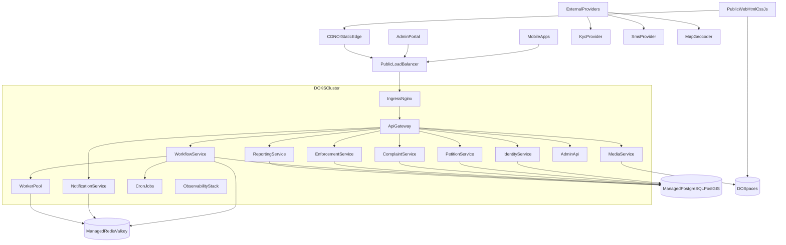
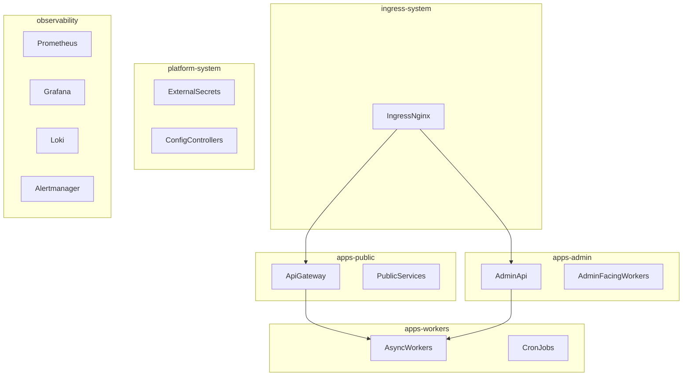

# DigitalOcean Infrastructure Architecture

## Purpose
This document defines the Stage 4 infrastructure baseline for:
- DigitalOcean deployment topology
- Kubernetes namespaces and workloads
- ingress, TLS, secrets, and service exposure
- managed PostgreSQL, Redis/Valkey, and Spaces usage
- backup and restore model
- monitoring, logging, and alerting
- operational access model

## Infrastructure Principles
- Keep the backend on managed DigitalOcean primitives where possible.
- Use Kubernetes for application workloads, not for self-hosting databases on day one.
- Separate public traffic, internal traffic, and privileged operational access.
- Keep the public web stack simple and cacheable.
- Make media and KYC storage policies explicit from the start.
- Design for auditability, recoverability, and gradual scaling.

## Deployment Scope
### In scope on DigitalOcean
- `DOKS` managed Kubernetes cluster
- Managed `PostgreSQL`
- Managed `Redis/Valkey`
- `DO Spaces`
- `DO Load Balancer`
- `DO Container Registry`
- `DO DNS`

### Application components
- public API gateway
- admin API
- modular backend services
- async workers
- cron jobs
- observability stack

### Client delivery
- Public web site: `HTML + CSS + JavaScript`
- Mobile apps: external clients consuming backend APIs

## Recommended Environment Model
- `dev`
- `staging`
- `production`

### Practical recommendation
- For cost control at the start:
  - `dev` and `staging` may share one cluster with separate namespaces
  - `production` should be isolated in its own cluster once public launch approaches

### Long-term recommendation
- one DOKS cluster for `nonprod`
- one DOKS cluster for `prod`

## High-Level Topology

## Web Delivery Recommendation
For the public website built with `HTML + CSS + JavaScript`, the default recommendation is:
- store static assets in `DO Spaces`
- front them with CDN
- call backend APIs over `api.<domain>`

Why:
- cheapest and simplest distribution path
- strong caching behavior
- less Kubernetes resource usage
- easy multilingual static pages and public content delivery

### Alternative
If needed later:
- serve the web bundle from an `nginx` container in DOKS
- keep admin portal separate from public site

## Kubernetes Baseline
### Node pool recommendation
#### `system-pool`
- small dedicated nodes
- ingress, cert-manager, cluster add-ons

#### `app-pool`
- main API and worker workloads

#### `observability-pool`
- optional at first
- Prometheus, Loki, Grafana if they become heavy

### Scaling recommendation
- horizontal pod autoscaling for API services
- queue-length or custom-metric scaling for workers
- separate resource requests for API and worker workloads

## Namespace Design
Recommended namespaces:
- `ingress-system`
- `cert-manager`
- `platform-system`
- `apps-public`
- `apps-admin`
- `apps-workers`
- `observability`
- `security`

If sharing non-production environments in one cluster:
- `dev-public`
- `dev-admin`
- `dev-workers`
- `staging-public`
- `staging-admin`
- `staging-workers`

## Service Exposure Model
### Public endpoints
- `www.<domain>` for the public site
- `api.<domain>` for resident and mobile API
- `admin.<domain>` for city staff and operations

### Internal-only exposure
- worker services
- metrics endpoints
- callback processors if routed internally behind API

### Exposure rules
- only ingress controller is publicly exposed
- application services stay `ClusterIP`
- do not expose PostgreSQL or Redis directly to the public internet

## Ingress and TLS
### Ingress controller
- `ingress-nginx` on DOKS

### TLS
- `cert-manager` with Let's Encrypt
- separate certificates for:
  - `www.<domain>`
  - `api.<domain>`
  - `admin.<domain>`

### Routing
- `www` -> static site or web service
- `api` -> public API gateway
- `admin` -> admin API or admin frontend

### Security rules
- HSTS for public and admin domains
- redirect HTTP to HTTPS
- stricter rate limiting on auth and upload routes
- tighter body size limits on non-media routes

## Secrets and Configuration
### Recommended model
- plain application config in `ConfigMaps`
- secrets in Kubernetes `Secrets`
- preferably synchronized by `External Secrets` or equivalent secret manager flow

### Secrets to manage
- JWT signing keys
- KYC provider credentials
- SMS provider credentials
- map/geocoder credentials
- database connection strings
- Redis credentials
- Spaces access keys
- notification provider keys

### Rules
- no hardcoded secrets in repos
- separate secrets per environment
- limited read access to production secrets
- rotate provider credentials on a defined schedule

## Managed PostgreSQL
### Recommendation
- use managed PostgreSQL with `PostGIS` enabled
- primary + standby/replica for production
- private networking where possible

### Usage
- primary transactional storage
- full-text search baseline
- spatial queries for districts, city boundaries, and complaint/enforcement routing

### Access rules
- cluster workloads access DB through private connection
- no routine direct access for municipality users
- DBA access restricted to engineering/admin roles

## Managed Redis / Valkey
### Recommendation
- use managed Redis/Valkey
- private network access from DOKS

### Usage
- queues
- rate limiting
- session and step-up markers
- short-lived caches

### Rules
- do not store the source of truth in Redis
- configure memory eviction policy appropriate for cache and queue roles

## DO Spaces
### Buckets or logical prefixes
- `public-web-assets`
- `civic-platform-media`

### Prefix model
- `kyc/`
- `petitions/`
- `complaints/`
- `enforcement/`
- `derived/`

### Rules
- public web assets may be public-read behind CDN
- KYC media must never be public
- complaint and enforcement media should be private and served via signed access
- enable versioning or operational safeguards where supported for critical buckets

## Workload Placement
### Public API workloads
- `api-gateway`
- identity endpoints
- petition endpoints
- complaint endpoints
- enforcement endpoints
- media upload session endpoints

### Admin workloads
- moderation
- assignment
- dispatch
- official responses
- audit views
- reporting dashboards

### Worker workloads
- media processing
- KYC result processing
- notification delivery
- geodata normalization
- report generation

### Cron jobs
- stale session cleanup
- retry outbox jobs
- digest and weekly report generation
- archival and retention enforcement

## Networking and Policy
### Recommended controls
- Kubernetes `NetworkPolicy` between namespaces
- only ingress controller may reach public services
- only allowed namespaces may reach PostgreSQL and Redis
- workers may reach Spaces and provider APIs

### Optional hardening
- egress restrictions by namespace
- web application firewall in front of public domains
- IP allowlisting for admin domain if municipality policy permits

## Backup and Restore
### PostgreSQL
- daily automated backups
- point-in-time recovery enabled for production
- periodic test restore into non-production environment

### Redis / Valkey
- if managed snapshots are available, enable them for operational safety
- remember Redis is not the source of truth

### Spaces
- retain original uploaded media according to retention policy
- protect against accidental deletion with versioning or backup copy strategy if needed

### Kubernetes configuration
- store manifests and infrastructure definitions in git
- regularly export or version important cluster configuration through IaC

### Restore drills
- quarterly restore drill for:
  - database recovery
  - media access verification
  - application startup against restored data

## Monitoring, Logging, and Alerting
### Metrics
- `Prometheus`
- `Grafana`

Track:
- API latency
- error rate
- queue depth
- worker throughput
- DB connection saturation
- Redis memory and connection use
- Spaces upload and processing failures
- KYC callback success/failure
- notification delivery success/failure

### Logs
- `Loki` or equivalent centralized log aggregation
- structured JSON logs from apps
- separate sensitive log filtering for KYC and identity flows

### Alerting
- `Alertmanager`
- alerts to email, Slack, Telegram, or municipality-approved channel

Priority alerts:
- API outage
- high error rate
- DB unreachable
- Redis unavailable
- worker queue backlog
- failed KYC callbacks spike
- failed media processing spike
- backup failure

### Error tracking
- `Sentry` for backend and web/mobile clients

## Operational Access Model
### Engineering roles
- `platform-admin`
  - cluster administration
  - production infrastructure changes
- `backend-operator`
  - application deploys
  - log and metrics access
- `support-readonly`
  - dashboards and selected logs

### Municipality roles
- municipality users do not receive infrastructure access by default
- municipality operators use only the application admin portal
- inspectors use only operational application interfaces

### Access rules
- least privilege
- separate personal accounts
- no shared admin credentials
- privileged actions logged and reviewed
- break-glass access limited and audited

## Environment Promotion Model
### Recommended path
- `dev -> staging -> production`

### Release expectations
- feature verified in `dev`
- integrated and smoke-tested in `staging`
- approved and deployed to `production`

Detailed release sequencing belongs to Stage 5, but the infrastructure supports this flow.

## Production Readiness Recommendations
- production DOKS isolated from non-production
- production PostgreSQL with standby or replica
- production Redis managed separately from non-production
- autoscaling enabled for API and workers
- alerts wired before public launch
- backup restore drills completed before launch
- admin domain security tightened before municipality onboarding

## Stage 4 Output
This document defines the approved infrastructure baseline for:
- DigitalOcean topology
- Kubernetes namespace strategy
- ingress and TLS
- managed data services
- media storage layout
- backup and restore expectations
- monitoring and operational access
